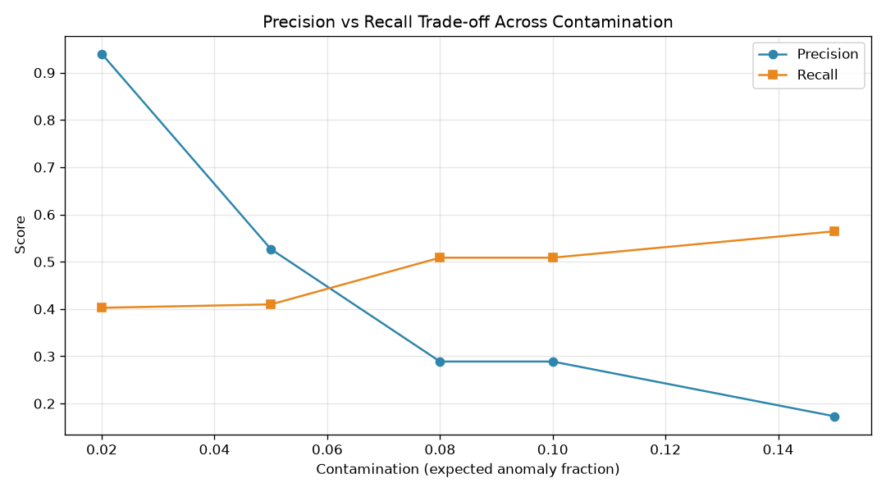
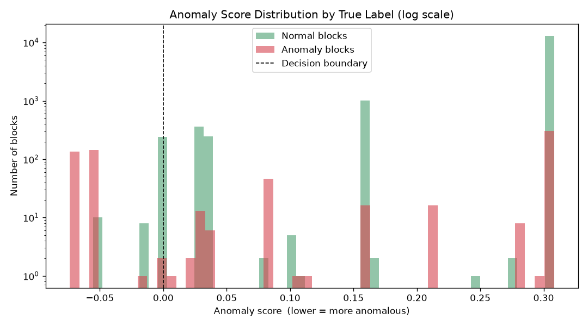

# AIOps: Log Anomaly Detection using Isolation Forest


Detecting anomalies in system logs using **unsupervised machine learning** — no labels required at training time. The pipeline replaces brittle, hand-written regex parsing with automatic **log template mining**, turns unstructured logs into a numeric feature matrix, and flags anomalous behaviour with an **Isolation Forest**.

Evaluated on the public **HDFS** log dataset with ground-truth labels, the detector reaches **94% precision** on its highest-confidence predictions — roughly **11× better than random** for a dataset where only \~4.5% of blocks are anomalous.

\---

## The Problem

Production systems emit millions of log lines. Buried in them are the early signs of failures — but finding those signs by hand is impractical, and writing regex rules to catch known-bad patterns is brittle: every new log format means a new rule, and rules can only catch problems you already anticipated.

This project takes an **unsupervised** approach instead: learn what "normal" looks like from the data itself, then flag whatever deviates — including anomalies no one wrote a rule for.

\---

## Approach

The pipeline runs in four stages:

**1. Template mining (kill the regex).**
Raw log lines are parsed with the **Drain3** algorithm, which automatically groups similar lines into templates, replacing the variable parts (IDs, IPs, sizes) with wildcards. For example:

```
PacketResponder 1 for block blk\_3886504906... terminating
PacketResponder 0 for block blk\_-695229586... terminating
```

both collapse to the single template:

```
PacketResponder <\*> for block <\*> terminating
```

On a 2,000-line sample this reduced the logs to **\~17 distinct templates** — a \~130:1 compression — with **zero hand-written parsing rules**.

**2. Feature engineering (logs → numbers).**
Log lines are grouped into **sessions by block ID** (each `blk\_...` is one unit of work in HDFS), and each session becomes a row in an **event-count matrix**: columns are templates, cells are how many times each template fired in that block. This numeric fingerprint is what the model reasons over.

**3. Anomaly detection.**
An **Isolation Forest** scores each block by how easily it can be isolated from the rest. Normal blocks sit in dense regions and take many random splits to isolate; anomalies are off on their own and isolate in few splits. The model is fully unsupervised — it never sees the labels during training.

**4. Evaluation.**
Predictions are compared against the dataset's ground-truth `Normal`/`Anomaly` labels to compute precision, recall, and F1, and the `contamination` threshold is swept to map the precision/recall trade-off.

\---

## Results

Evaluated on **15,639 labeled HDFS blocks** (698 true anomalies, \~4.5%) parsed from the full dataset.

### Precision / recall trade-off

Sweeping the `contamination` parameter (the model's assumed anomaly fraction) trades false alarms against missed anomalies:

|contamination|flagged|precision|recall|F1|
|:-:|:-:|:-:|:-:|:-:|
|**0.02**|299|**0.940**|0.403|**0.564**|
|0.05|543|0.527|0.410|0.461|
|0.08|1229|0.289|0.509|0.368|
|0.15|2278|0.173|0.564|0.265|



At the conservative setting, **94% of flagged blocks are genuine anomalies** — a detector an on-call engineer could actually trust without alert fatigue. Pushing `contamination` higher catches more anomalies (recall up) at the cost of more false alarms (precision down). There is no single "correct" value: the right point depends on whether missing an anomaly or raising a false alarm is more costly for the system.

### Score separation

Plotting anomaly scores by true label (log scale) shows the model cleanly separating the most anomalous blocks — the low-score region is dominated by true anomalies (red) — while a subset of anomalies that look statistically normal in count-space blend into the normal region (the source of the missed detections):



\---

## Experiment: TF-IDF weighting

Raw event counts treat a template that appears in almost every block the same as a rare, informative one. **TF-IDF weighting** downweights common templates and emphasizes rare ones — a technique borrowed from text analysis.

|features|best F1|best precision|
|-|:-:|:-:|
|Raw counts|**0.564**|0.940|
|TF-IDF|0.541|**0.984**|

**Finding:** TF-IDF did not improve balanced F1, but it pushed peak precision to **98.4%** — making it the better choice when minimizing false alarms is the priority. The best feature representation depends on the objective: catch everything, or trust every alert.

\---

## Limitations \& next steps

* **Count-based features miss order.** The model keys on *how many* of each event occur, not their *sequence*. Anomalies that use only normal events in an abnormal order look normal in count-space and are missed. Sequence-aware features (n-grams of templates, or a sequence model) would target these.
* **Single-slice evaluation.** Metrics are computed on a 200k-line slice of the full logs. The pipeline scales to the full 11M-line dataset unchanged; a full run would give a headline number on the complete corpus.
* **Static threshold.** `contamination` is fixed; an adaptive threshold could respond to changing log volumes.

\---

## Tech Stack

Python · scikit-learn (Isolation Forest, TF-IDF) · Drain3 (template mining) · pandas · matplotlib

## Project Structure

```
├── data/                          # log data \& generated CSVs (gitignored)
├── results/                       # output plots
│   ├── anomaly\_score\_distribution.png
│   └── precision\_recall\_tradeoff.png
├── src/
│   ├── parse\_logs.py              # Drain3 template mining
│   ├── build\_features.py          # event-count matrix (fixed windows)
│   ├── build\_labeled\_dataset.py   # block-based labeled matrix from full logs
│   ├── detect\_anomalies.py        # Isolation Forest detection
│   ├── evaluate.py                # precision/recall/F1 + contamination sweep
│   ├── evaluate\_tfidf.py          # TF-IDF feature experiment
│   └── visualize.py               # result plots
├── requirements.txt
└── README.md
```

## Running it

```bash
# 1. Set up environment
python -m venv venv
venv\\Scripts\\activate            # Windows  (source venv/bin/activate on macOS/Linux)
pip install -r requirements.txt

# 2. Get the data
# Download HDFS\_v1.zip from https://zenodo.org/records/8196385
# Place anomaly\_label.csv in data/ and point build\_labeled\_dataset.py at HDFS.log

# 3. Run the pipeline
python src/build\_labeled\_dataset.py   # parse + build labeled feature matrix
python src/evaluate.py                # metrics + contamination sweep
python src/evaluate\_tfidf.py          # TF-IDF experiment
python src/visualize.py               # generate plots
```

## Dataset

HDFS logs from [**Loghub**](https://github.com/logpai/loghub) (Zhu et al., *Loghub: A Large Collection of System Log Datasets for AI-driven Log Analytics*, ISSRE 2023). The dataset is not committed to this repo; download instructions are above.

